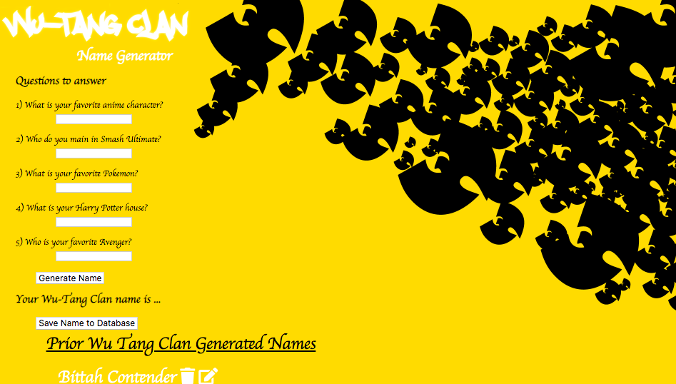

# Wu Tang Clan Name Generator with Features
A web application with CRUD functionality that allows users to answer 5 questions to produce a sample Wu Tang Clan name. This web application keeps track of all of the generated names people have gotten if you choose to save your name to the database. This app allows you to edit your Wu Tang Name and it allows you to delete your generated name from the database if you wish to do so.

## Usage

1. Navigate to `localhost:2020`

## How It's Made:

**Tech used:** HTML, CSS, JavaScript

The project focused on creating client side JavaScript, server side JavaScript, CSS for styling, and an EJS file to render the html page. This project also uses express for building the server and mongodb database to store the collections and documents containing the data.

## Optimizations

An incremental count would be nice to keep track of each of the generated names. In addition, for upcoming edits I would used a different method instead of the prompt method to allow the user to edit their Wu Tang Clan name entry sent to the database.

## Lessons Learned:

I learned that this project has all the basic CRUD App functionality by using a personal built API with endpoints that allow the user to create, read, update, and delete content from the browser and database. In addition, I learned to troubleshoot more effectively on the console and on the terminal with this particular project.
